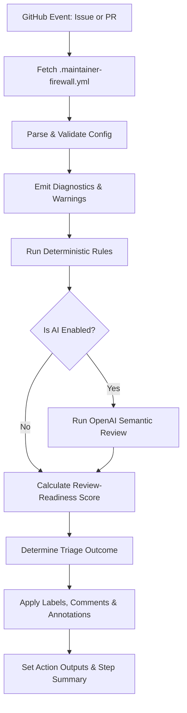

# 🛡️ Maintainer Firewall

[](https://github.com/Hephaestus-DevKit/maintainer-firewall/releases)
[](https://github.com/Hephaestus-DevKit/maintainer-firewall/actions)
[](https://opensource.org/licenses/MIT)
[](https://nodejs.org/)
[](https://makeapullrequest.com)

**Maintainer Firewall** is a GitHub Action designed for open-source maintainers who want a calmer, high-signal triage queue. It reviews incoming issues and pull requests for evidence, reproducibility, scope, test coverage, and project-specific contribution guidelines.

> [!NOTE]
> **What this is NOT**: This is not an "AI detector." It doesn't try to guess if a human or a machine wrote a contribution. Instead, it asks the only question maintainers actually care about: **Is this contribution actionable, complete, and maintainable?**

---

## 🗺️ Documentation Map

To dive deeper into specific areas of the firewall, check out the dedicated guides:

*   **[Installation Guide](docs/INSTALLATION.md)** — First-time setup, token permissions, fork PR safety, and first-run checklists.
*   **[Rollout Playbook](docs/ROLLOUT_PLAYBOOK.md)** — Strategies for auditing, advisory, collaborative, and strict rollout modes.
*   **[Rules Reference](docs/RULES.md)** — Detailed trigger conditions, stable finding IDs, severity tuning, and suppressions.
*   **[Troubleshooting](docs/TROUBLESHOOTING.md)** — Solutions for permissions, AI API limits, labeling, and release flows.
*   **[Architecture & Flow](docs/ARCHITECTURE.md)** — Internal design, dependency layout, and security sandbox model.
*   **[Maintenance Guide](docs/MAINTENANCE.md)** — Standard operating procedures for PR reviews, releases, and tests.
*   **[V1 API Contract](docs/V1_CONTRACT.md)** — Stable input/output definitions, JSON report shapes, and compatibility policy.
*   **[Marketplace Readiness](docs/MARKETPLACE_READINESS.md)** — Public beta checklists, security scanning, packaging, and listing rules.
*   **[Adoption Playbook](docs/ADOPTION_PLAYBOOK.md)** — Running pilots with design partners, collecting metrics, and templates.
*   **[Pilot Runbook](docs/PILOT_RUNBOOK.md)** — Step-by-step instructions for running a first audit-mode pilot in a real repository.
*   **[Evaluation Guide](docs/EVALUATION.md)** — How to run and interpret deterministic evaluation fixtures and rule coverage reports.
*   **[AI Data Boundary](docs/AI_DATA_BOUNDARY.md)** — What data is sent to OpenAI, redaction guarantees, and opt-out instructions.
*   **[Metrics](docs/METRICS.md)** — Available metrics outputs, the workflow example, and how to aggregate run reports.

---

## ⚙️ How It Works

Here is a look at the firewall execution pipeline:



---

## ✨ Core Features

*   🔍 **Evidence-Based Filtering**: Analyzes issue bodies for completeness, environmental context, and minimal reproduction steps.
*   🚦 **Pull Request Inspection**: Checks descriptions, linked issues, size/scope, and test coverage of modifications.
*   🤖 **Context-Aware AI Review (Optional)**: Employs OpenAI to assess contributions against your project's specific guidance (loaded from `CONTRIBUTING.md`, issue/PR templates).
*   🛡️ **Security Redaction & ReDoS Safety**: Automatically redacts environment secrets/credentials before processing and shields itself from ReDoS vectors.
*   📊 **Robust Diagnostics**: Emits detailed configuration and runtime diagnostics as Action outputs, step summaries, and JSON reports.
*   🚦 **CODEOWNERS Routing**: Generates routing hints based on CODEOWNERS mapping for quick assignment triage.

---

## 📈 Rollout Modes

Introduce Maintainer Firewall gradually to build trust and avoid disrupting contributors.

| Mode | Event | Permissions | Action Description |
| :--- | :--- | :--- | :--- |
| **Audit** | `pull_request` | `contents: read`, `issues: read`, `pull-requests: read` | Read-only. Outputs results purely to Actions step summaries. No comments/labels. |
| **Advisory** | `pull_request_target` | `contents: read`, `issues: write`, `pull-requests: write` | Low noise. Comments only when actionable improvements are found. |
| **Collaborative** | `pull_request_target` | `contents: read`, `issues: write`, `pull-requests: write` | Full engagement. Automatically applies triage labels and writes feedback comments. |
| **Strict** | `pull_request_target` | `contents: read`, `issues: write`, `pull-requests: write` | Gatekeeping. Fails the workflow run when findings do not meet quality thresholds. |

---

## 🚀 Quick Start

### Step 1: Create the Workflow File

Create a file named `.github/workflows/maintainer-firewall.yml` with the following configuration to start in **Audit Mode** (safe, read-only):

```yaml
name: Maintainer Firewall

on:
  issues:
    types: [opened, edited, reopened]
  pull_request:
    types: [opened, edited, synchronize, reopened, ready_for_review]

permissions:
  contents: read
  issues: read
  pull-requests: read

concurrency:
  group: maintainer-firewall-${{ github.event.issue.number || github.event.pull_request.number || github.run_id }}
  cancel-in-progress: true

jobs:
  firewall:
    runs-on: ubuntu-latest
    steps:
      - name: Run Maintainer Firewall
        uses: Hephaestus-DevKit/maintainer-firewall@v0.7.1
        with:
          github-token: ${{ secrets.GITHUB_TOKEN }}
          dry-run: true
```

### Step 2: Add Configuration File (Optional)

Add a `.maintainer-firewall.yml` to the root of your repository to override defaults, suppress specific checks, or enable AI:

```yaml
# yaml-language-server: $schema=https://raw.githubusercontent.com/Hephaestus-DevKit/maintainer-firewall/main/schema/maintainer-firewall.schema.json
version: 1

rules:
  severityOverrides:
    issue-reproduction-missing: warning
    pr-tests-missing: warning

comment:
  enabled: true
  postWhen: findings  # Only comment when improvements are needed

labeling:
  enabled: false      # Enable when ready to auto-label issues/PRs
```

---

## 🛠️ Inputs & Outputs

### Inputs

| Input | Required | Default | Description |
| :--- | :--- | :--- | :--- |
| `github-token` | **Yes** | | GitHub token used to read repository context and write comments/labels. |
| `openai-api-key` | No | | OpenAI API Key. Only required if `ai.enabled: true` is configured. |
| `config-path` | No | `.maintainer-firewall.yml` | Repository-relative path to your firewall configuration. |
| `dry-run` | No | `false` | When `true`, prevents writing comments, applying labels, or removing stale labels. |
| `fail-on-findings` | No | `false` | Fail the workflow run if any findings are flagged. |
| `emit-annotations` | No | `false` | Emit findings as native GitHub workflow warnings and errors. |
| `write-step-summary` | No | `true` | Write the summary report to the GitHub Actions job run summary. |
| `report-json-path` | No | | Path in the workspace to output a structured JSON report. |
| `effective-config-json-path` | No | | Path in the workspace to output the redacted, active config snapshot. |

### Outputs

| Output | Type | Description |
| :--- | :--- | :--- |
| `outcome` | string | Final outcome: `ready`, `needs_info`, `needs_tests`, `needs_maintainer_review`, `blocked`, or `skipped`. |
| `score` | number | Review-readiness score (0 to 100). |
| `findings-count` | number | Total number of findings. |
| `labels` | string | Comma-separated list of suggested labels. |
| `routing-hints` | string | JSON array of CODEOWNERS-derived routing targets. |
| `skipped` | boolean | `true` if the issue/PR met suppression rules and was skipped. |
| `skip-reason` | string | Reason the subject was skipped, when applicable. |
| `report-json-path` | string | Path to the structured JSON report when configured. |
| `effective-config-json-path` | string | Path to the redacted effective configuration report when configured. |
| `config-warnings-count` | number | Count of configuration validation warnings. |
| `config-warnings` | string | JSON array of configuration diagnostics emitted. |
| `runtime-warnings-count` | number | Count of runtime diagnostics warnings. |
| `runtime-warnings` | string | JSON array of runtime diagnostics emitted. |

---

## 💻 Local Development

Get started with local testing and hacking:

```bash
# Install dependencies
npm install

# Run build, verify formatting, and run test suite
npm run ci

# Execute the local demo environment
npm run demo

# Evaluate test cases and rule coverage
npm run evaluate
```

> [!TIP]
> The compiled and bundled output lives in `dist/index.js`. If you change files in `src/`, make sure to bundle the action before committing:
> ```bash
> npm run bundle
> ```

---

## 📄 License

This project is licensed under the **MIT License**. See the [LICENSE](LICENSE) file for more information.
